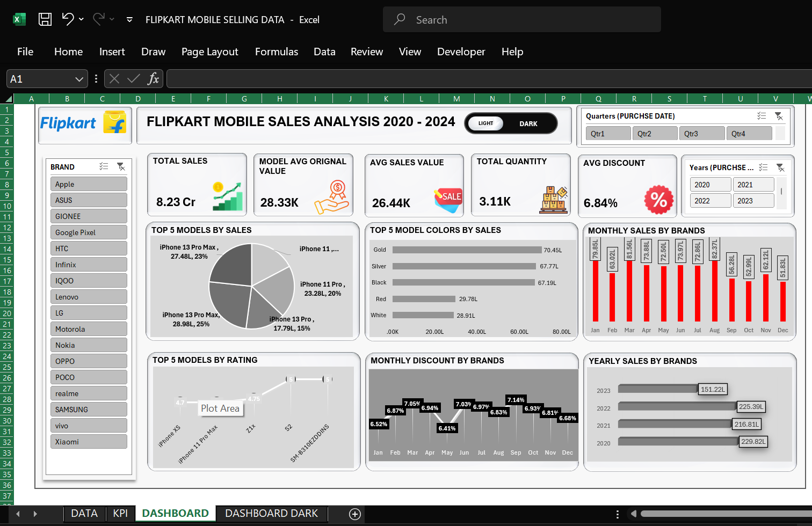
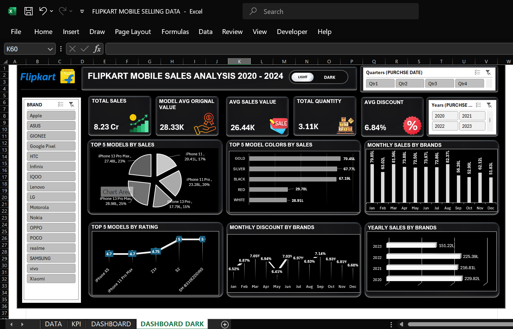
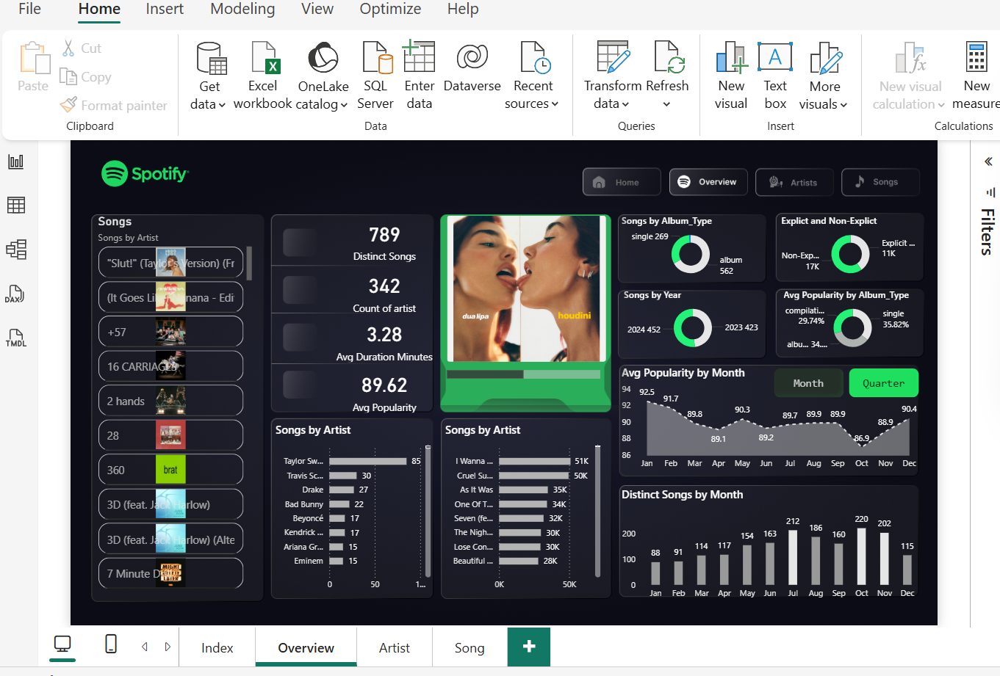
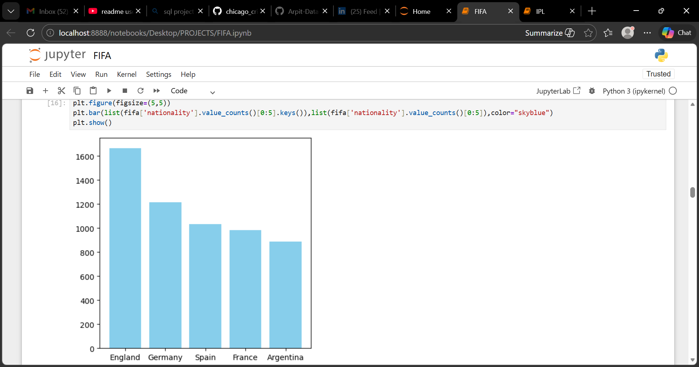
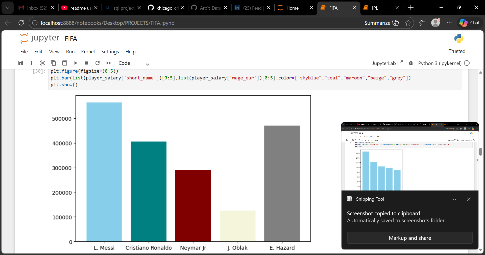
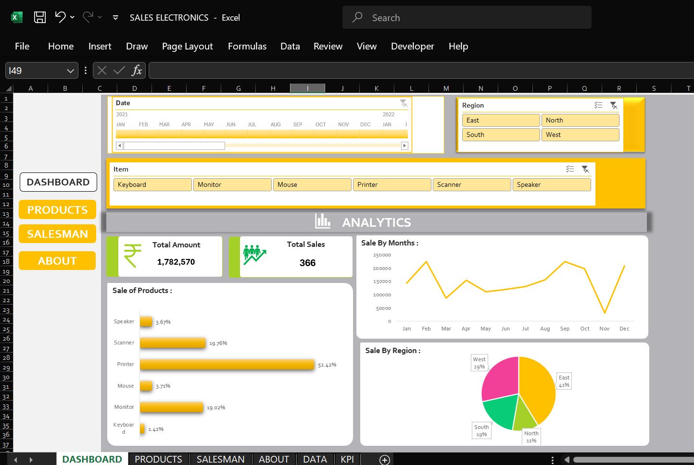

# Arpit Data Analyst Portfolio

Welcome to my Data Analyst portfolio repository.
This repository contains projects where I analyze datasets and build dashboards to generate insights.

---

# 👨‍💻 About Me

Aspiring Data Analyst skilled in data analysis, dashboard creation and visualization.

### Skills

* Python
* SQL
* Microsoft Excel
* Power BI
* Data Cleaning
* Data Visualization
* Exploratory Data Analysis

---

# 📁 Projects

# 📱 Flipkart Mobile Sales Analysis

## Project Overview

This project analyzes Flipkart mobile sales data from 2020–2024 to understand brand performance, sales trends, pricing patterns, and discounts.

## Tools Used

* Microsoft Excel
* Data Analysis
* Dashboard Design

---

# 📊 Dashboard

## 🌞 Light Theme Dashboard

---

## 🌙 Dark Theme Dashboard

---

## Key Insights

* Apple and Samsung dominate sales.
* Top 5 models contribute a large share of total revenue.
* Sales fluctuate across months.
* Discount percentage changes throughout the year.

---

## Skills Demonstrated

* Data Cleaning
* Excel Dashboard Creation
* Data Visualization
* Business Insight Generation

### Insights

* Apple and Samsung dominate mobile sales.
* Certain models contribute a large share of total sales.
* Discounts vary across months.

---

## 🎵 Spotify Music Dashboard

Analysis of Spotify music dataset using Power BI.

### Tools Used

* Power BI
* Data Visualization

### Dashboard

### Insights

* Most songs are released as singles.
* Monthly popularity trends fluctuate.

---

## ⚽ FIFA Player Analysis

Python analysis of FIFA player dataset.

### Tools Used

* Python
* Pandas
* Matplotlib
* Jupyter Notebook

### Sample Charts

### Insights

## 📱 Flipkart Mobile Sales Analysis

Analysis of mobile sales data from 2020–2024.

### Tools Used

* Microsoft Excel
* Dashboard Design
* Data Analysis

### Dashboard

* Certain countries dominate football players.
* Elite players earn significantly higher wages.

---

# 📬 Author

Arpit Chandel
Aspiring Data Analyst
